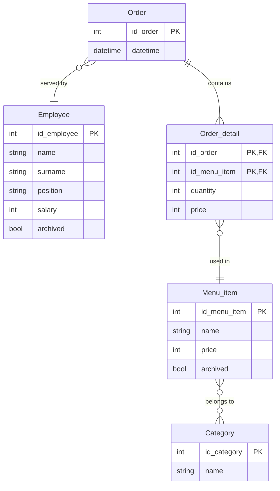
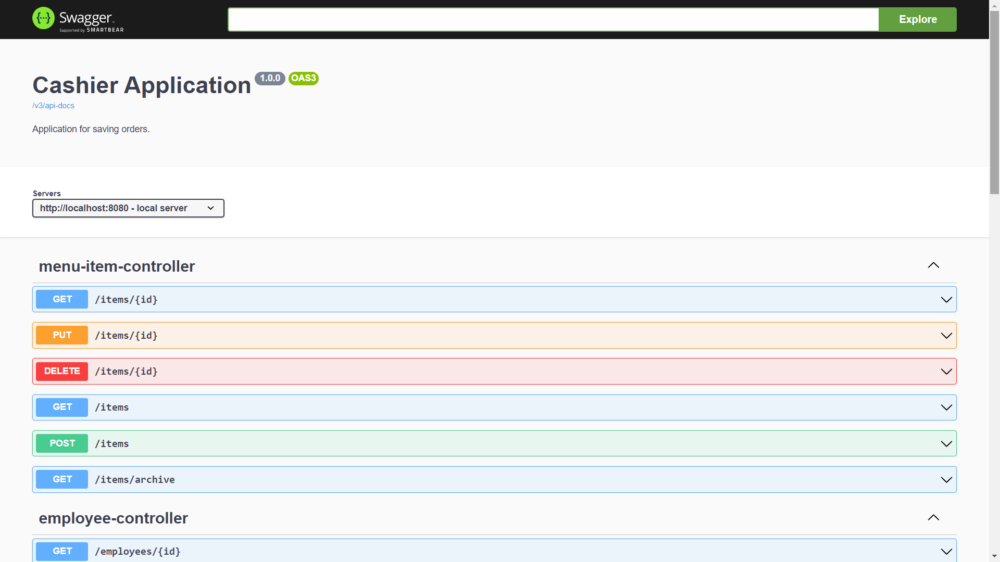

# Cashier application

This is a study project for Java Technology course from the Faculty of Information Technologies of Czech Technical
University. It is a simple Spring Boot cashier server application that allows employees to save orders and managers to
get statistics about their business. The application uses an external free database provided by ElephantSQL that
contains test data with coffeehouse items and roles.

## Database model



## Complex database query

Each employee gets additionally 10% from every served order added to salary. The query will get prices from all orders
served by an employee for the past month and calculate his/her bonus.

## Business operations

- Save order (complex business operation):  
  User will pick menu items from a list, pick their quantity, get total price and save info to the database
- Change menu
- Change current user

### Only for managers

- Update employees
- Count total profit
- Count money for paychecks

## Application startup

To start the app run command:

```shell
docker compose up
```

## API Documentation

After application startup Swagger API documentation will be available at http://localhost:8080/swagger-ui/index.html:

