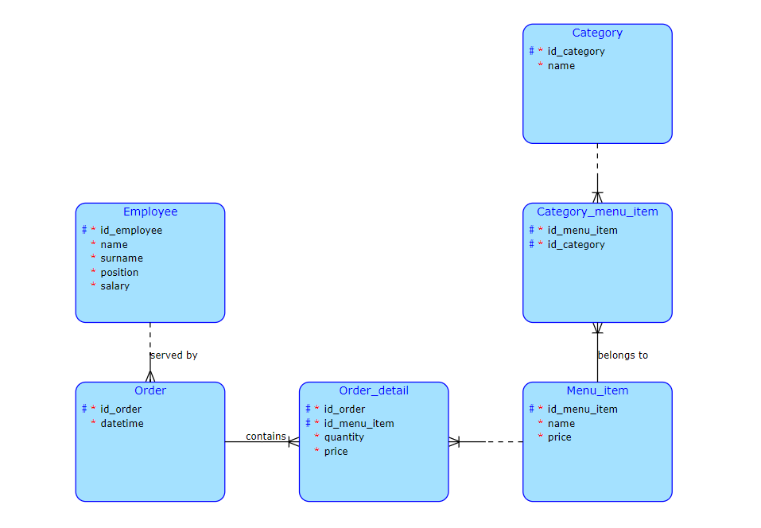

# Coffeehouse cashier application

Repository with client application: https://gitlab.fit.cvut.cz/nikolnik/bi-tjv-semestral-client

I've taken inspiration from my DBS semestral work about coffeehouses. This will be a simple cashier application  
for a coffeehouse that will allow employees to save orders and managers to get statistics about their café.

## Database model

## Complex database query
 
Each employee gets additionally 10% from every served order added to salary.  
The query will get prices from all orders served by an employee 
for the past month and calculate his/her bonus.

## Business operations

- Save order (complex business operation):  
  User will pick menu items from a list, pick their quantity, get total price and save info to the database
- Change menu
- Change current user

### Only for managers

- Update employees
- Count total profit
- Count money for paychecks

### Application startup

To start the app run command:

`gradle bootRun`